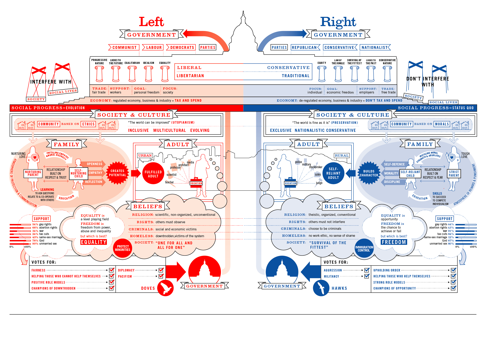
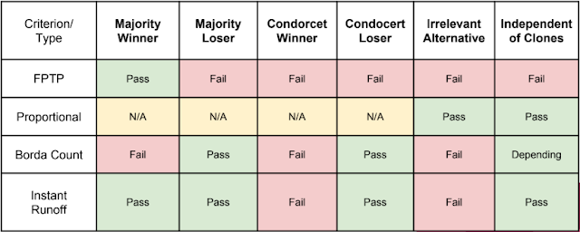

```{r setup, include=FALSE}
knitr::opts_chunk$set(echo = FALSE)
```

This past semester I've had the privilege and pleasure of participating in Dr. Donna Hoffman's senior seminar class entitled Reforming the Republic. This class is reserved for seniors who are Political Science majors, which I am not. I'm a Statistics and Actuarial Science major who has a poly sci minor. I am very happy to have had this chance to take this class and specifically grateful for Dr. Jill Wittrock who recommended me for the class. It has been an amazing semester that has really pushed me to think about many different issues.


The class started out by establishing the different schools of though at play in the United States political climate. Namely classical republicanism and classical liberalism as well as looking at them as a hybrid. It's not a perfect fit because our framework was much less ideological, but this info graphic about political thought that shows a sort of break down of different attributes by left or right ideologies.


*Image from (https://informationisbeautiful.net/visualizations/left-vs-right-world/)*

Classical liberalism has these qualities:

+ Focused on the individual
+ More freedom at the cost of safety
+ Self reliance 
+ Individual representation (more direct)

Classical republicanism had these qualities:

+ Focused on the community
+ Requires Civic Virtue in citizens
+ One-for-all attitude
+ Group representations (further removed)

The definition building took place over the first 3 to 4 weeks and could be a paper unto itself. However, without getting too deep into the details, these served as our framework for which we would discuss the student topics. That's right student topics! Once the framework was out of the way each student had a topic they had selected in the first week. The students could use a reading in the course text book, or suggest other scholarly reading. Then each student lead a lecture/class discussion about their topic. The class would way the different parts of the framework and decide if the object of discussion was classically liberal or republican. Then we would talk about if the topic at hand was good as it is or how it could be improved

I loved this approach as I had to become the expert on the topic. I had to prepare for a lecture and potential questions. I know many of the students reconsidered their stances on their own issues after doing their research and presenting. I did my lecture/discussion on the electoral college, which with 2016 being so fresh and Trump's presidency being so controversial has been a topic of much debate. Many of my peers initially wanted to remove it as it wasn't working. My position is that it was working as intended, the problem was the education of citizens and how the election looks like a popularity contest. Though I could see how its disadvantages, after my research I wasn't sure if it should be removed  By the end of class, we had discussed alternatives and the impacts of its removal and decided that it was not worth removing. Which is fitting considering how even when it was designed no one was really happy with it, however it was a compromise that worked. It's a very classically republican approach to representation as it adds a further layer between the people and the president, however the founding fathers did not want the people to be directly involved in their government for fear it would turn into a popularity contest. 

After the lectures came a final project. Most students opted to examine their lecture topic again and presented on that, however I decided to still focus on elections but to shift my focus from the presidency to our representatives. Being a fan of rational choice theory and other mathy types of analysis decided to examine election systems and their axiomatic properties. They way votes are counted can make a huge difference in outcomes. I find this topic fascinating and if you would like to read about this more, Dr.  Donald G. Saari has a book called [Basic Geometry of Voting](https://www.springer.com/us/book/9783540600640) which is a wonderful read on the consequcences of various voting systems. 

I considered four kinds of voting systems, the first was our current system which is considered to be First Past the Post. Then I looked at the oft suggested proportional system. Then I looked at the Borda Count, which has some interesting mathematical properties. Finally I looked at Instant Run Off Voting, which is a special case of plurality systems. I covered the basic axioms that the systems would be compared on and explained Arrow's Impossibility theorem which simply put says the only system that would meet every axiom is a dictatorship. 

The criteria I examined were majority winner and looser, Condorcet Winner and Loser, Irrelevant Alternative, and Independence of Clones. There are many more, but for practicality and times sake I only covered these as they were the most interesting and easy to explain. 

First past the post is simply a system where the winner is the one who received the largest plurality. This is the most common system for many things because it's intuitive, but it actually creates some interesting issues, such as if two candidates are similar, and there is an alternative in opposition, then the dissimilar candidate could win even if combined the similar candidates would have won.

An example with numbers:

***If candidate (A) has 45% <br>
And candidate (B) has 35% <br>
And candidate (C) has 20% <br>
Then Candidate (A) will win ** *
  
This system is prone to tactical voting, gerrymandering, straight ticket voting and more. It really is probably the worst system over all. However it is simple and intuitive and seems fair. Appearance of fairness is something I didn't explore in depth, but would make for an interesting study. 

Proportional voting can take many different forms, so I examined the standard example where people vote for parties. then based on the number of votes, seats are assigned. I find this easier to understand with some example numbers.

***If in a given district there are 10 seats 

   If party (A) has 45% 
   And party (B) has 35%
   And party (C) has 20% of the vote** *
   
Seats would be divided such that
   
  + (A) wins 5 seats
  + (B) wins 4 seats
  + (C) wins 1 seat
  
This is a very descriptive system and can really bring support for smaller parties as voters feel safe voting for them. On the downside however, it can harm party identity and form coalitions. In terms of statistics I would compare its results to over fitting a model. It fits that particular set of voters well, however as the population changes it may not fit will on the new data. 

The Borda count is a ranked voting system. Here the voters rank each candidates and the candidates are assigned points based off their ranking. Saari suggested making the points equal to the number of candidates below, however usually  other point systems will result in the same results. This system is also descriptive and looks more closely at how voters feel about each candidate. It is very hard to implement and educate people on and can be confusing. 

Finally, I talked about instant run off voting, which is another ranked vote system. This one however is iterative. Each voter ranks the candidates and then votes are tallied. Only the top candidate is considered. Then if a candidate has the majority, they win. Otherwise the losing candidate (or more depending on set up) is dropped. Those that voted for them are then counted with their second choice. Then votes are tallied again. This repeats until a candidate has the majority. 

I looked at each system and compared it with the criteria. Then I compared the number of criteria that they passed. Which I would like to remind you isn't the only important thing as no system outside of a dictatorship can ever meet all the criteria. However it is a nice starting point for examination. I examined some of the other costs of these systems would be and made my conclusion. 



Personally I'm a huge fan of the Borda Count, but in fitting with the framework we had established I concluded my presentation suggesting Instant runoff voting as it fit with both frameworks quite well and thus would be easier to  implement. 

I was very happy with my presentation and how it was received, I was also very excited by the class. 
If you would like to see my presentation, a copy of the slides are available [here.](https://drive.google.com/file/d/1T3bZgmyGBJLNC9dM_QTCJSTxkqPWT-N_/view?usp=sharing)