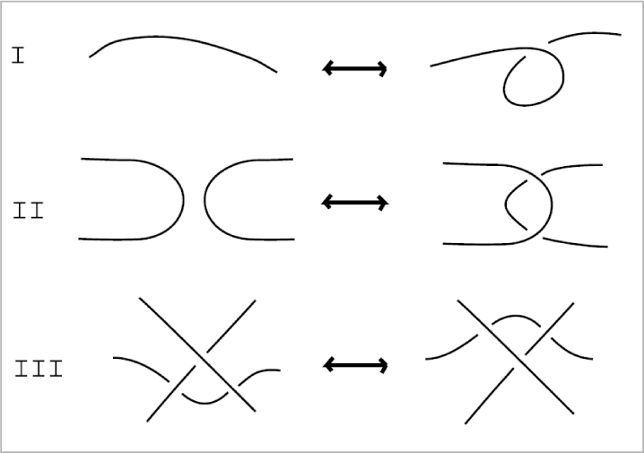
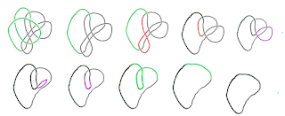
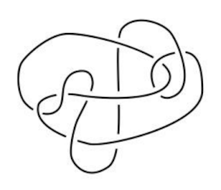
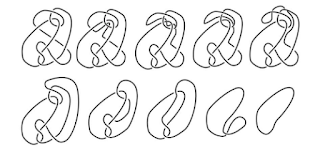

```{r setup, include=FALSE}
knitr::opts_chunk$set(echo = FALSE)
```

I took one of the most interesting math classes this semester. Before you go that's probably cause your a math nerd, I mean most interesting for anyone. While there was some mathematical knowledge needed, this class was unique because of how intuitively based the class was. We were experimenting and exploring without specific theorems for the most part. We studied **Knot Theory**. 

Knot theory has a long history that I should probably devote an entire post to, but to make it's history short, it was a field that was created based on the notion that atoms were created from aether and the different atoms were made from differently knotted loops. This was quickly disproved and the field as a whole was under investigated. Now, however it's a field unto math itself, where as it advances other topics such as topology learn from it. In genetics, for example knot theory is being used to untangle DNA. I've heard earbud manufactures are investigating this field to combat the knots you make when you put them in your pocket.  But it is now one of my favorite fields of math because of how beautiful it is. For example look at this short knot table from Wikipedia. 


This field has some very interesting questions but the central question is basically how can one tell if one knotted structure is the same as another. This is the fundamental question of the subject. To be equivalent, a knot and another knot must without cutting the strand be able to be arranged into the same state. Often this is done by simplifying the knots by reducing their complexity. knots in their simplistic forms have been tabled with great difficulty. 

We spent a few weeks on developing intuitions with knots and learning how to describe their movement.  However as it turns out there are three kinds of moves that describe everything about how you can move knots. These are called Reidemeister moves. These are shown below. 



Basically these are the only way to make a knot more or less complicated or to manipulate it in general. Types 1 and 2 can change complexity, Type 3 shows that a strand can be moved under or over a crossing without cutting. 

About halfway though the course we were asked to select topics for our project. I decided to select that of something called hard unknots. The unknot is simply a closed loop with no twists. These can be disguised by using the above moves to make them seem like actual knots. I chose these because unknotting is beautiful and satisfying and feels a lot like a puzzle. Here is a diagram of an unknotting I did for my project. It's pretty simple but it shows what has to be done. 



We can evaluate knots based on complexity. For example a fully solved unknot has complexity of 0 and my example above has complexity of 15. Complexity is the number of crossing in a knot. the knot 3-1 has complexity of 3 and is irreducible. However in my example above you can see how by using a combination of Reidemeister moves the knots complexity was reduced. I did skip over some steps to save space in my diagram. Type 1 moves can change complexity by 1, either adding or subtracting. Type 2 moves can change complexity by 2. Type 3 moves do not change complexity at all. 

A hard unknot is then a knot who has no simplifying Type 1 or Type 2 moves. So in essence a knot that needs to increase its complexity before in can be unknotted.  Take for example this knot called the culprit. This is a hard unknot it has no simplifying moves. We know it's an unknot based on something called invarients, which is too complicated for this explanation. 



However, after adding complexity the knot can be untangled. The next diagram shows this process.




 I then looked into computing upper bounds for hard unknots to determine how much more complicated the knot needs to get before it can be reduced. Upper bounds are much easier to calculate than lower bounds for many reasons. This is calculated by putting a knot into arc presentation, which has a finite number of destabilizing moves. In  arc presentation every knot can be unknotted without increasing complexity. There is a theorem in one of the papers I read about this that provided a formula which is a little more in depth than I want to go here.  So for the culprit, the maximum upperbound is 324 crossings and we only had to push it from 10 to 12 crossings. So there is a large margin for error there. We only used 10 moves to reduce earlier, but with the upper bound the number is 10^35 which is a tad bit higher.

This leaves a fair bit of space for knot theorists to work on reducing the upper bound and potentially even find a lower bound. It's an exciting unexplored field of mathematics!

Feel free to look at the powerpoint I gave to my classmates [here](https://drive.google.com/file/d/1HMZ2ZA7mu71VEuxe5QumM3BzhF8d4YqE/view)