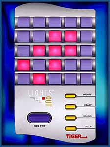

```{r setup, include=FALSE}
knitr::opts_chunk$set(echo = FALSE)
```

Last semester, I spent the majority of the my time in my visual basic class working on my final project. I had to create an application with several specific features. I also spent a good deal of time learning about the mathematics behind Lights Out, and why they're a little more advanced than what I learned in my linear algebra class.



I thought that this was an interesting enough puzzle to share some of what I learned about the puzzle while developing my own app for it. For those unfamiliar with the game, it takes place in a 5x5 grid of buttons. Each button has two positions: on and off. To complete a puzzle the goal is to turn all lights to an off position (some variants allow turning all on as well) Pressing a button will flip all positions of buttons in a cross to the opposite state. Due to this the board can actually be represented by a matrix where a 1 indicates an on light and a 0 indicates a light off. For example the board shown above would be represented as

$\begin{bmatrix}
 0 &0 &0 &0 &0 \\
 0 &0 &1 &1 &0 \\
 0 &1 &1 &1 &0 \\  
 1 &0 &1 &0 &0 \\
 0 &1 &0 &0 &0 \\
\end{bmatrix}$

A move can be described by a matrix as well. if we press the center square we would have a move that looks like

$\begin{bmatrix}
 0 &0 &0 &0  &0 \\
 0 &0 &1 &0  &0 \\
 0 &1 &1 &1  &0 \\
 0 &0 &1 &0  &0 \\
 0 &0 &0 &0  &0
\end{bmatrix}$

And using basic modular arithmetic (or Modulo operation) we have our math such that when we have $1+1 = 0$.

So we can then add our move to the original matrix like so

$\begin{align*}\begin{bmatrix}
 0 &0 &0 &0 &0 \\
 0 &0 &1 &1 &0 \\
 0 &1 &1 &1 &0 \\  
 1 &0 &1 &0 &0 \\
 0 &1 &0 &0 &0 \\
\end{bmatrix} +
\begin{bmatrix}
 0 &0 &0 &0  &0 \\
 0 &0 & 1 &0  &0 \\
 0 &1 &1 &1  &0 \\
 0 &0 &1 &0  &0 \\
 0 &0 &0 &0  &0
\end{bmatrix} = \begin{bmatrix}
 0 &0 &0 &0 &0 \\
 0 &0 &0 &1 &0 \\
 0 &0 &0 &0 &0 \\  
 1 &0 &0 &0 &0 \\
 0 &1 &0 &0 &0 \\
\end{bmatrix}\end{align*}$

So with some modular linear algebra we can start to express solutions. As we're simply doing linear addition, we have can take advantage of the commutative property to show that the order that we press buttons doesn't matter. Meaning that an optimal solution can be found in less than 25 flips. 

Did I say 25? well that's actually 2 too many! If you delve deeper you can find what some refer to as quiet patterns. when these are used they won't actually affect the board in a meaningful way. In fact, these can be used to test for solvable boards. To avoid going to far into the weeds, you can see more on these here. This means that there are $2^{23}$ possible board states as well. 

Now for solving the puzzle there's a few options. One is to try to math it out, which while optimal is a lot of work for the average person. The other is what's called light chasing. This is a strategy where you press the buttons below the lights that are on in a descending order. From there, there are a few patterns that can be memorized to press to solve.  The table below shows the bottom row and then if you should press the button in the top row.

|If the bottom row looks like thisBottom Row |Press this in the	Top Row  | 
|:---------:|:--------:|
|0 0 <b>1 1 1</b>  |	F F F <b>T</b> F|
|0 <b>1</b> 0 <b>1</b> 0  |	F <b>T</b> F F <B>T</b>|
|0 <b>1</b><b>1</b> 0 <b>1</b> |	<B>T</b> F F F F|
|<b>1</b> 0 0 0 <b>1</b>  |	F F F <B>T</b> <B>T</b>|
|<b>1</b> 0 <b>1</b> <b>1</b> 0  |	F F F F <B>T</b>|
|<b>1</b> <b>1</b> 0 <b>1</b> <b>1</b>  |	F F <B>T</b> F F|
|<b>1</b> <b>1</b> <b>1</b> 0 0  |	F <B>T</b> F F F|


I thought this was very interesting and easier than doing all the linear algebra to find a solution even if this method isn't as efficient. If you record your moves you can look for duplicated presses and for that puzzle learn the optimal solution. 

~~All that being said, this was a roundabout way to say that you can download a simplified version of my project here.~~

Edit: due to hosting issues with google docs, and a crashed college computer this file is no longer available and may be lost to time. Instead, please enjoy the simple javascript version I made [here](https://delabj.com/Portfolio/logame/).