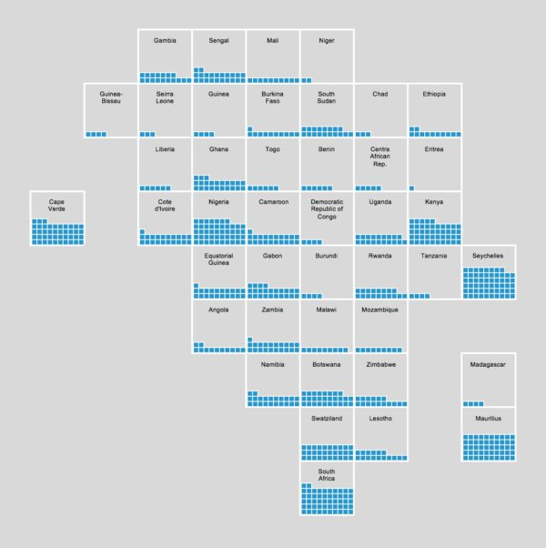
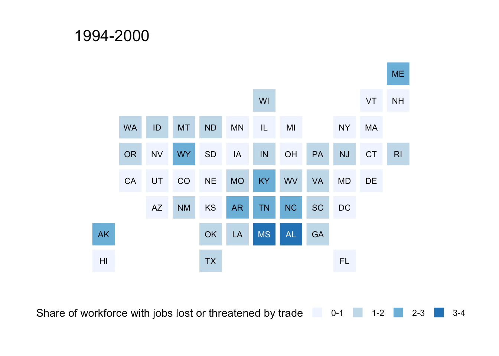
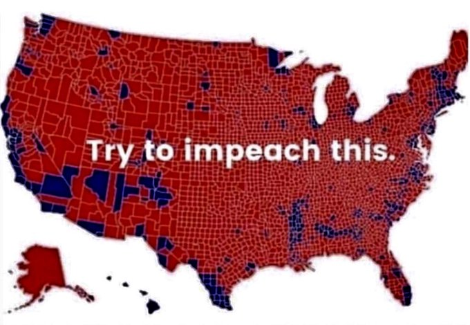
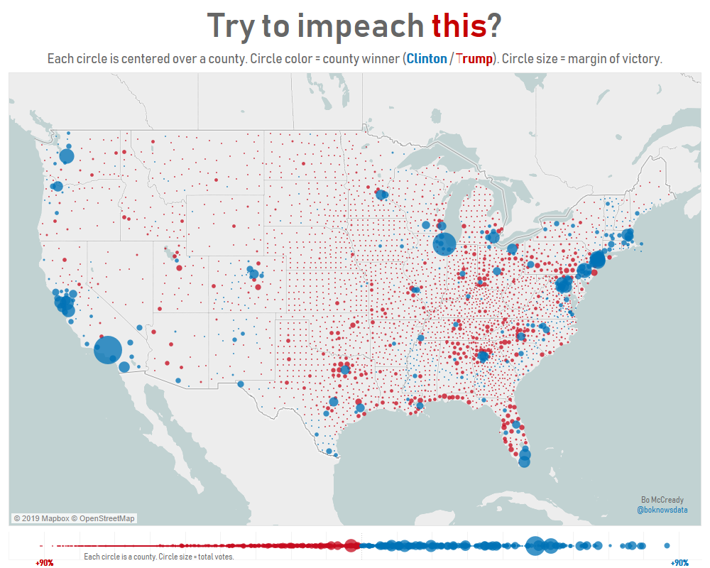
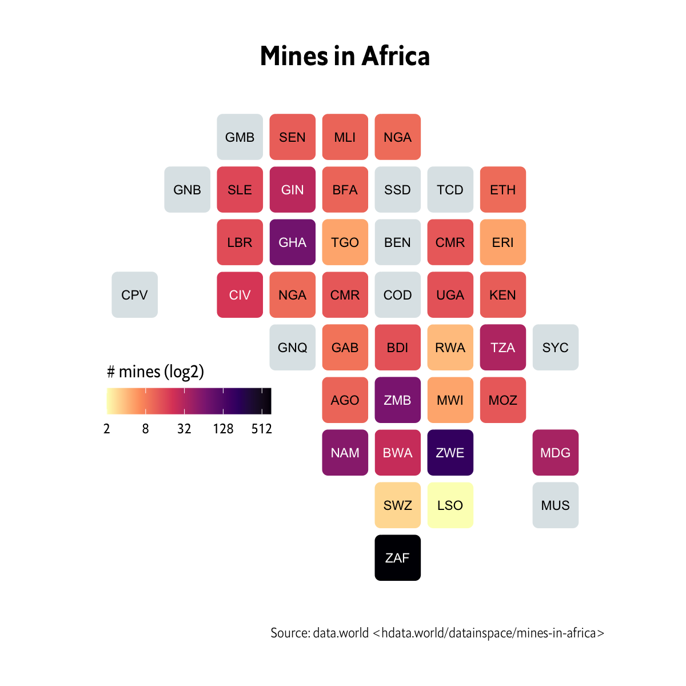

```{r setup, include=FALSE}
knitr::opts_chunk$set(echo = FALSE)
```

Similar to {`ggcyberpunk`}, I spend a little time doing some social media driven development with a Twitter friend that works for a NGO in Africa. I saw a tweet by [@schwabish](https://twitter.com/jschwabish) with an excel tiled waffle chart map of Africa in a thread about bin maps. 



You can buy the excel file from Jon for ~$5 [here](https://policyviz.com/product/africa-tile-grid-waffle-chart-map-excel/), but it made me think of the US-centric [{`statebins`}](https://github.com/hrbrmstr/statebins) package by [Bob Rudis](https://rud.is/b/). His package was designed after the style of a [Washington Post Article on Trade](https://www.washingtonpost.com/wp-srv/special/business/states-most-threatened-by-trade/). He recreated one of their plots as an example of what his package could do. 



I'm a big fan of this style of map as it avoids some of the issues that a typical choropleth has with area skewing perception of prevalence. In the US this allows each state to be compared on equal footing. This isn't a unique idea by WaPo, and there are many variations, with hexagons, all with the goal of preserving the neighbors as best they can. 

Take for example the notorious "impeach this" map

 
Which beyond having inaccurate coloring for the regions, and ignoring potentially changed minds, also misrepresents land as people supporting him. I quickly mocked up what this map would look like if you went by states

```{r, include=FALSE}
library(tidyverse)
library(statebins)

elect_2016 <- tribble(~state, ~winner, 
        "WA", "Dem",
        "OR", "Dem", 
        "CA", "Dem", 
        "NV", "Dem", 
        "CO", "Dem", 
        "NM", "Dem", 
        "ID", "Rep",
        "SD", "Rep",
        "UT", "Rep",
"AZ", "Rep", 
"MT", "Rep", 
"WY", "Rep", 
"ND", "Rep", 
"NE", "Rep", 
"KS", "Rep", 
"OK", "Rep", 
"TX", "Rep", 
"MN", "Dem", 
"IA", "Rep", 
"MO", "Rep", 
"AR", "Rep", 
"LA", "Rep", 
"WI", "Rep", 
"IL", "Dem", 
"MS", "Rep",
"MI", "Rep", 
"IN", "Rep", 
"KY", "Rep", 
"TN", "Rep", 
"AL", "Rep", 
"OH", "Rep", 
"GA", "Rep",
"FL", "Rep",
"NC", "Rep", 
"SC", "Rep", 
"VA", "Dem", 
"WV", "Rep", 
"PA", "Rep", 
"NY", "Dem", 
"VT", "Dem",
"NH", "Dem", 
"ME", "Split",
"MA", "Dem", 
"RI", "Dem", 
"CT", "Dem", 
"NJ", "Dem", 
"DE", "Dem", 
"MD", "Dem", 
"DC", "Dem", 
"AK", "Rep", 
"HI", "Dem"
        )

ggplot(elect_2016)+
  geom_statebins(aes(state=state, fill = winner))+
  theme_statebins()+
  scale_fill_manual(values=c("navy", "red", "purple"))+
  delabj::legend_bottom()+
  guides(fill = guide_legend(title.position = "top"))
```


I am of course comparing states to counties, here and there are other better electoral district maps available with a similar goal, but it's clear that some states have disproportionate ink when compared to their population, for reasons like land size to population ratio or the map projection. Personally, I think this map is much better than even the bins as it works on the county level.



I got a little sidetracked here, but the idea is simple. Provide equal ink for each state and create a heatmap instead of skewing perception with sizes. After seeing the waffle map of Africa, I wondered how hard it would be to create a remix of {`statebins`}. Turns out it's fairly simple, but time consuming. 


I ended up creating {`AfricaCountryBins`} a new package that allows users to create a similar binned map, for the entire continent of Africa. This was added as a new geom for ggplot, so you can use it in a very easy manner. It requires a country column with either the full name of the country, a 2 letter abbreviation (which apparently are nonstandard) or the standardized 3 character abbreviations. 

Bob Rudis actually noticed what I was doing, and added a wonderful data set and made this plot for the readme!



Hopefully this is a useful package and if you need something like this for your country/continent, let me know! I really just need a list of positions on a grid, and abbreviations and names and this can be easily made. Or if you're feeling adventurous, you can look through the code and make those adjustments yourself!