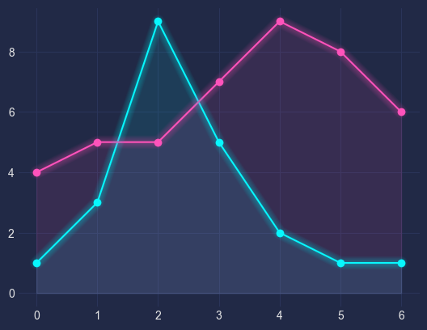
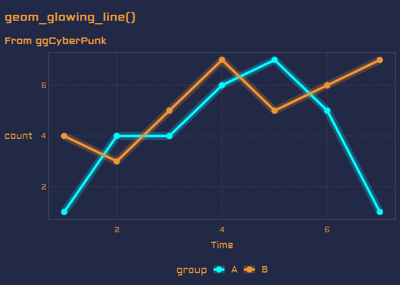
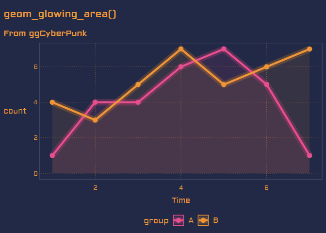

```{r setup, include=FALSE}
knitr::opts_chunk$set(echo = TRUE)
library(tidyverse)
library(vapoRwave)
library(ggCyberPunk)
```

## Why Did I Make this

It's not everyday that you see a post that makes you want to develop a R package, but that's what happened for me earlier this month. I was on [/r/rstats](www.reddit.com/r/rstats) and saw an [interesting post](https://www.reddit.com/r/rstats/comments/fsncqz/cyberpunk_plots_in_r/) from [/u/NTGuardian](www.reddit.com/u/NTGuardian), asking if there was a way to replicate Dominik Haitz's cyberpunk style for matplotlip. 



This plot is pretty cool looking and I think there are a few key elements that help with this. 

1. High Contrasting, neon colors on a dark background
1. Simple gridlines
1. Fuzzy glow making the neon look like it's glowing
1. The area under the line is shaded giving depth to the plot. 

This plot really feels like a neon sign to me. 

Since the world is ending and everything is awful, I figured I could spend a little bit of time doing some Reddit Driven Development. I figured it would be too hard to add glowing lines as a ggplot function. Plus it would be a nice distraction to how the Datafest I was supposed to have gone to with fellow WIU students was canceled because of COVID-19

## Exsisting Solutions

As far as I could tell, there wasn't a holistic solution to creating the desperately needed glowing line plot/area plot. From the comments of that thread and a few other options I thought about, I figured the following were the best options for anyone to make a cyberpunk styled plot. 

1. Use a theme package like {`vapoRwave`} and add `geom_ribbon(`) with a low alpha
1. Draw multiple lines of varying widths and alpha levels, similar to how I used to do lightsaber effects for stop motion.
1. A user suggested using ggEcho, which seemed interesting, but I had a few issues getting started with. 


I want to compare the first 2 methods as they seemed the most feasible. I'll be using this fake data to create the example plots. 

```{r,  warning=FALSE, include=TRUE}
df = data.frame(A=c(1,4,4,6,7,5,1),
               B=c(4,3,5,7,5,6,7),
               Time=c(1,2,3,4,5,6,7)) %>%
pivot_longer(cols = c(A,B),names_to = "group", values_to = "count")
```

I'll use the `geom_ribbon()` option first. (I'm cheating a bit here, by adding colors and theme from my package, but it makes it so much easier.)

```{r, warning=FALSE, message=FALSE}
df %>%
  ggplot(aes(x=Time, y=count, color = group, fill= group))+
  geom_area(alpha = .15, position = "identity")+
  geom_line(size = 1)+
  geom_ribbon(alpha = 0.25, aes(ymin = count+.20, ymax = count-.20), color = NA)+
  theme_cyberpunk()+
  scale_color_cyberpunk()+
  scale_fill_cyberpunk()
```

Yes the colors area  bit different, but this is a pretty good approximation of the glowing line. The ribbon gets a little inconsistent when the slope is changing however, and I'm not super thrilled with it enterly. 

```{r, warning=FALSE, message=FALSE}
df %>%
  ggplot(aes(x=Time, y=count, color = group, fill= group))+
  geom_area(alpha = .15, position = "identity")+
  geom_line(size = 3.0, alpha =.15)+
  geom_line(size = 2.5, alpha =.15)+
  geom_line(size = 2.0, alpha =.15)+
  geom_line(size = 1.5, alpha =.15)+
  geom_line(size = 1.0)+

  theme_cyberpunk()+
  scale_color_cyberpunk()+
  scale_fill_cyberpunk()
```

To me this option seemed like it had the most potential to be reproducible and to allow for users to customize it. This became the basis for my `geom_glowing_line()` and `geom_glowing_area()`


## How it works

Drawing multiple lines, gave a better glow effect in my opinion so I designed a function that would return multiple lines drawn on top of each other, each varying in alpha and width. This is very similar to how you can manually add a light saber effect to an image by masking with layered rectangle. (there are also plug ins that make this look way easier and you can add a blur effect much more easily.) 

An interesting aspect of how {`ggplot2`} functions is that each function returns a list that is added to the previous list. This means that you can create helper functions that return those items with relative ease. I didn't have to create a new stat or geom, instead I used a simple loop and quickly hacked together a set of what I call pseudo geoms. These appear to the user as geoms, but they don't rely on any actual elements that aren't already used by average users.

I decided to opt for a loop to allow users to customize how many layers they wanted to draw, and the alpha level with that. (This is cause alpha is additive, and adding more layers at the same alpha will make the line just thicker after a while)

I give 3 new geoms. 

1) `geom_glowing_line()`
  - This is just a glowing line.
  - I don't always think area plots are the best option for showing linear data, so I wanted a non area version
2) `geom_glowing_area()` 
  - This more closely matches the matplotlib version
  - Looks like a neon shadow under the lines
3) `geom_line_saber()` 
  - A more starwars inspired glowing line. 
  - The solid color on each line is white, and the glow is the color assigned to the group
  - No points are added either
  - I couldn't resist the pun of linesaber/lightsaber
  
  These are examples of what the these functions can do
  
  
#### geom_glowing_line()
  
  
  
#### geom_glowing_area()

  
  
#### geom_linesaber() 

  [geom_linesaber() demo](img/linesaber.png)
  
  
Since a lot of the effect also comes from high contrast colors and theme elements, I'm providing a set of colors I think fit the neon look and a theme that is basically a minimally adapted version of one of the {`vapoRwave`} themes. If I remember correctly, I matched the colors to the matplotlib package and changed the font. 


## Future Work

I would like to add additional geoms like points bars and make actual geoms rather than pesudo geoms. I think I could also optimize the code a little bit, I honestly was surprised at the attention this got after I posted it to reddit and twitter. I made it as a meme, but I've gotten a few messages from people using it for their work. I'm glad people have found my fun little reddit driven development useful!


